# CookTogether 🍳

CookTogether is a full-stack web application designed to be a modern, centralized platform for a community cooking club. It replaces the chaos of WhatsApp groups and Google Docs with a streamlined, feature-rich, and beautifully designed interface for sharing, discovering, and saving recipes.

## Overview

This project was built from the ground up to solve the problem of a growing cooking community struggling to manage their recipes. The platform provides a robust backend API built with Node.js/Express and a dynamic, fully responsive frontend built with React and Vite. It features a complete authentication system, advanced recipe filtering, and a polished UI/UX with modern animations and a dark mode.

## Table of Contents

- [Technologies Used](#technologies-used)
- [Features](#features)
- [Screenshots](#screenshots)
  - [Light & Dark Mode](#light--dark-mode)
  - [Landing Page](#landing-page)
  - [Login/Register Page](#loginregister-page)
  - [Home Page (Recipe Feed)](#home-page-recipe-feed)
  - [Recipe Detail Page](#recipe-detail-page)
  - [My Recipes Page](#my-recipes-page)
  - [Saved Recipes Page](#saved-recipes-page)
  - [Add New Recipe](#add-new-recipe)
  - [Mobile Filtering and Navigation](#mobile-filtering-and-navigation)
- [Getting Started](#getting-started)
  - [Prerequisites](#prerequisites)
  - [Backend Setup](#backend-setup)
  - [Frontend Setup](#frontend-setup)

## Technologies Used

### Frontend

-   **React + Vite:** A modern, fast, and powerful frontend framework for building dynamic user interfaces with TypeScript.
-   **Tailwind CSS:** A utility-first CSS framework for rapid and responsive UI development.
-   **shadcn/ui:** A collection of beautifully designed and accessible UI components.
-   **Magic UI:** A library of animated components for creating a delightful user experience.
-   **Zustand:** A small, fast, and scalable state management solution.
-   **Axios:** A promise-based HTTP client for making API requests.
-   **React Hook Form & Zod:** A powerful combination for robust and type-safe form validation.
-   **Firebase Client SDK:** For handling client-side user authentication.

### Backend

-   **Node.js & Express:** A fast and scalable JavaScript runtime and web framework for building the REST API.
-   **MongoDB & Mongoose:** A NoSQL database and Object Data Modeling (ODM) library for data persistence.
-   **Firebase Admin SDK:** For verifying user authentication tokens on the server.
-   **JSON Web Tokens (JWT):** Used within the authentication flow (though primarily managed by Firebase).
-   **Joi:** An object schema validation library for securing API endpoints.

## Features

-   **Full Authentication:** Secure user registration and login.
-   **Recipe Management:** Users can create, view, and rate recipes.
-   **Advanced Filtering & Sorting:**
    -   Live search by recipe title or ingredients.
    -   Filter by minimum rating, maximum prep time, and maximum cook time.
    -   Sort recipes by "Latest" or "Trending" (based on ratings).
-   **Saved Recipes:** Users can bookmark their favorite recipes to a personal collection.
-   **Interactive UI:**
    -   Animated theme toggler, typing animations, and magic cards for a modern feel.
    -   "Add Recipe" form presented in a professional, scrollable dialog.
-   **Fully Responsive Design:** A seamless experience on all devices, from mobile phones to desktops.
-   **Mobile-First UX:**
    -   Dedicated mobile navigation with a slide-out sheet.
    -   Responsive filter drawer for an intuitive mobile experience.
-   **Status Pages:** Custom pages for loading states and 404 Not Found errors.

## Screenshots

#### Note: The screenshots below are full-page scrolling captures designed to showcase the entire page layout, not to represent a single screen size.

### Light & Dark Mode

| Light Mode                                            | Dark Mode                                           |
| ----------------------------------------------------- | --------------------------------------------------- |
| 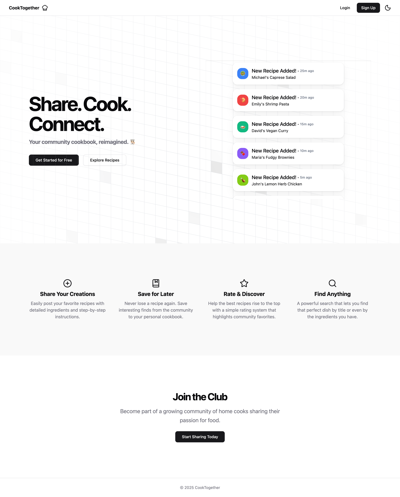 | 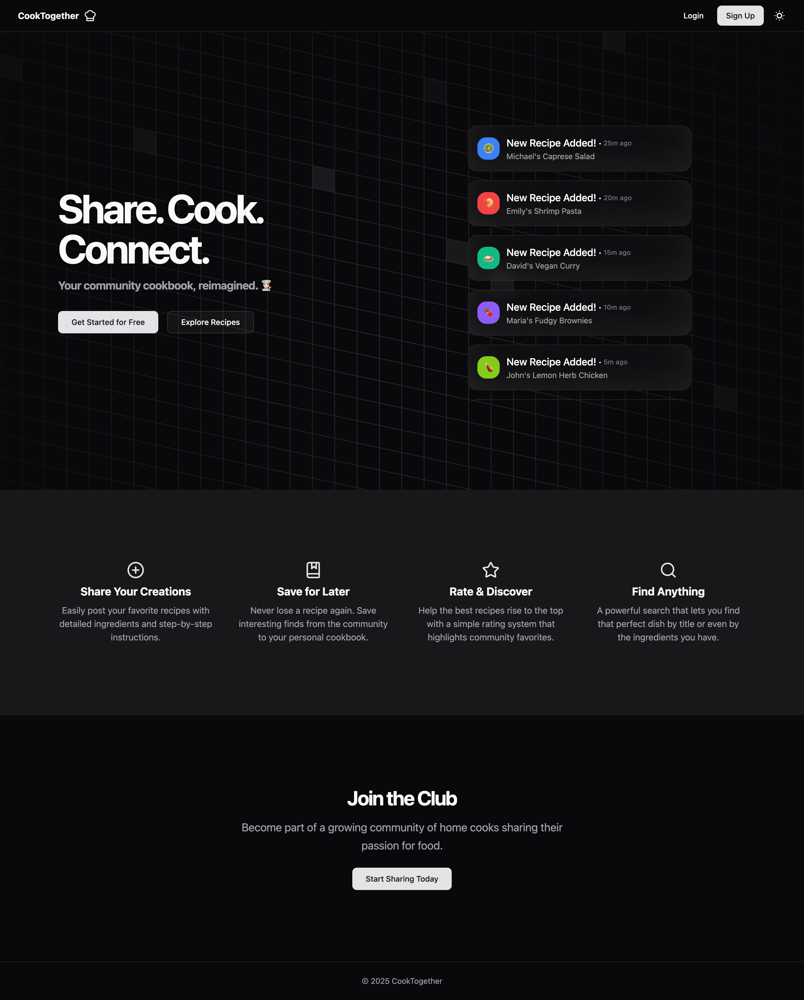 |

### Landing Page

| Desktop View(Authenticated)                          | Mobile View                                        |
| ---------------------------------------------------- | -------------------------------------------------- |
| 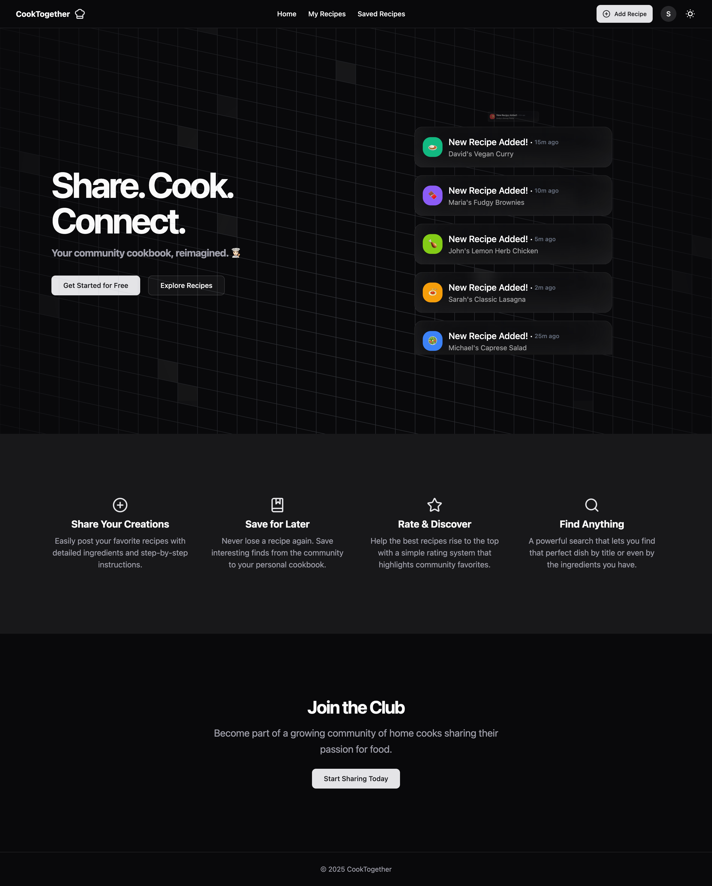 | 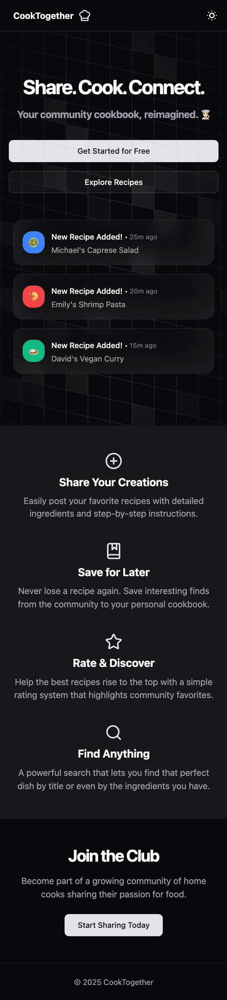 |

### Login/Register Page

| Desktop View                                       | Mobile View                                      |
| -------------------------------------------------- | ------------------------------------------------ |
| 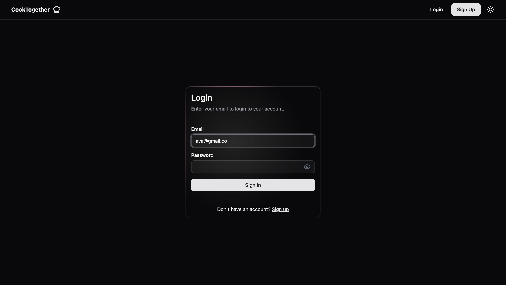 | 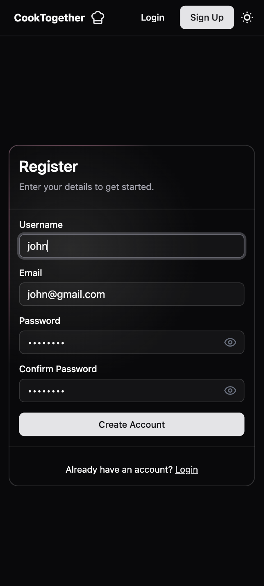 |

### Home Page (Recipe Feed)

| Desktop View                                     | Mobile View                                    |
| ------------------------------------------------ | ---------------------------------------------- |
|  | 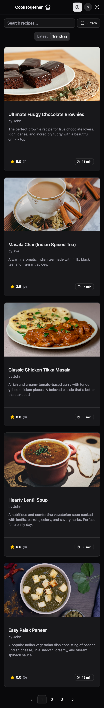 |

### Recipe Detail Page

| Desktop View                                           | Mobile View                                          |
| ------------------------------------------------------ | ---------------------------------------------------- |
| 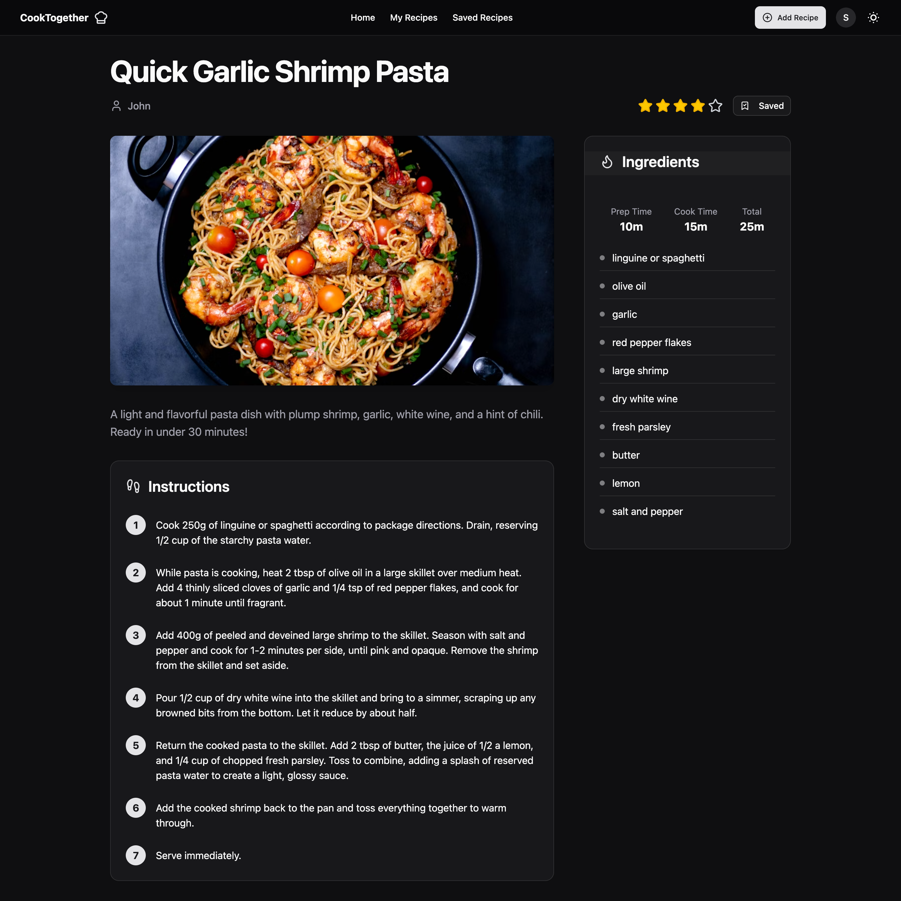 | 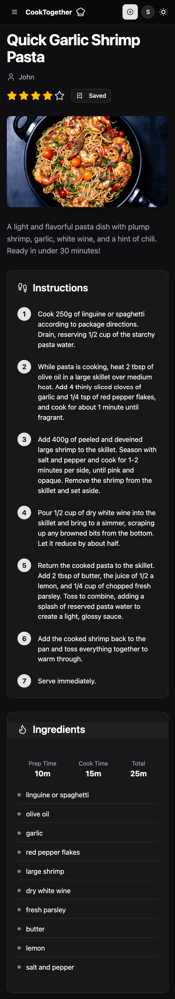 |

### My Recipes Page

| Desktop View                                               | Mobile View                                              |
| ---------------------------------------------------------- | -------------------------------------------------------- |
|  | 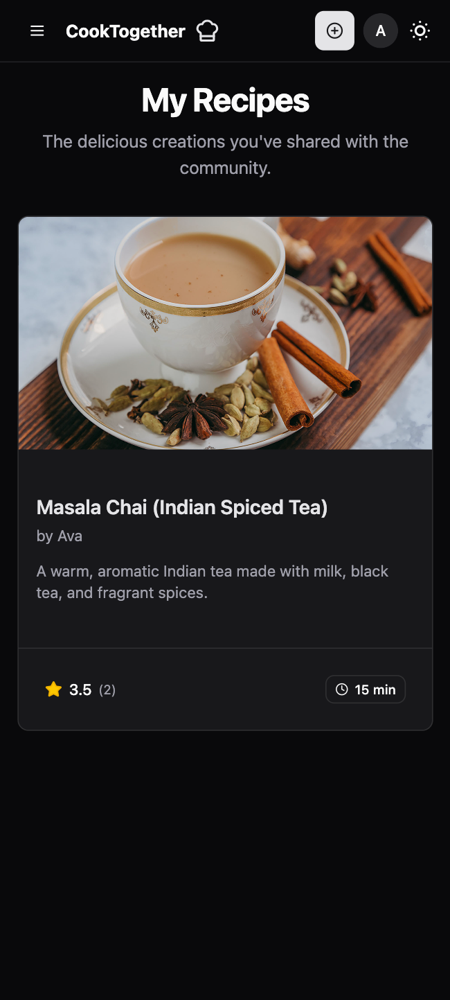 |

### Saved Recipes Page

| Desktop View                                                   | Mobile View                                                  |
| -------------------------------------------------------------- | ------------------------------------------------------------ |
| 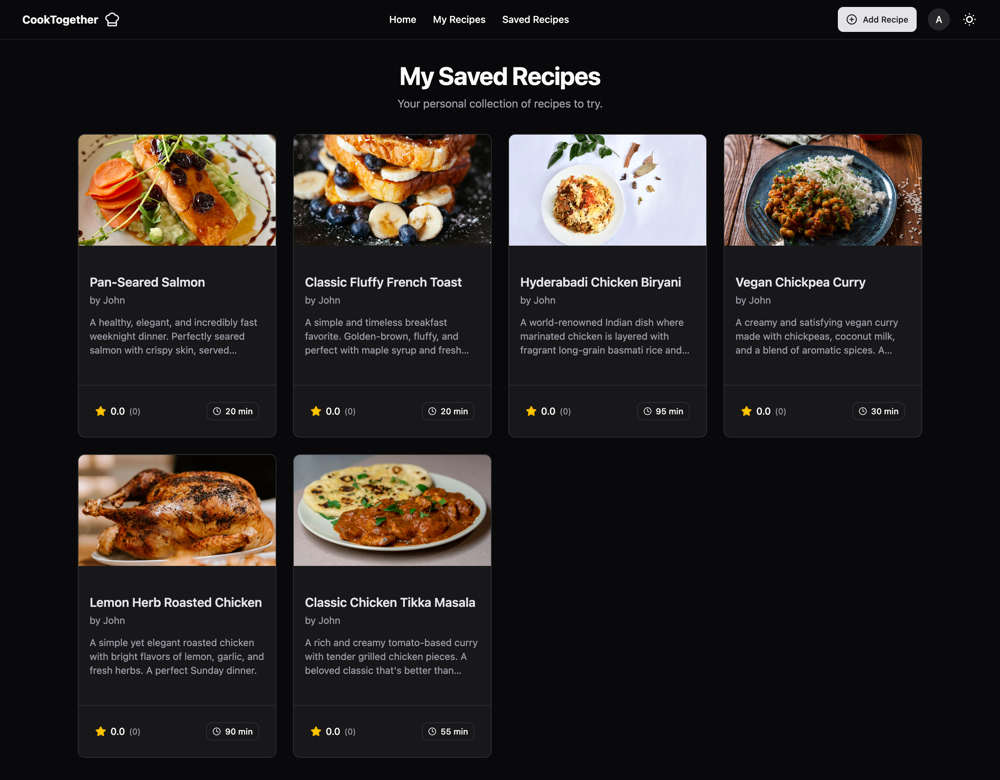 | 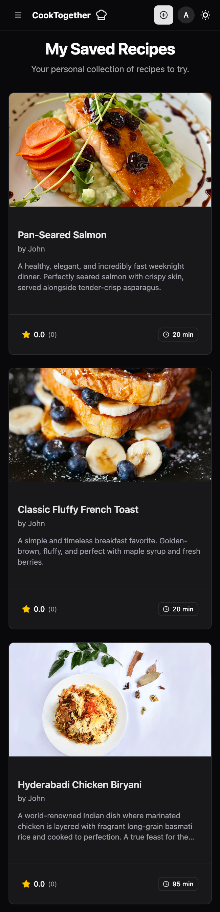 |

### Add New Recipe

| Desktop View                                         | Mobile View                                        |
| ---------------------------------------------------- | -------------------------------------------------- |
| 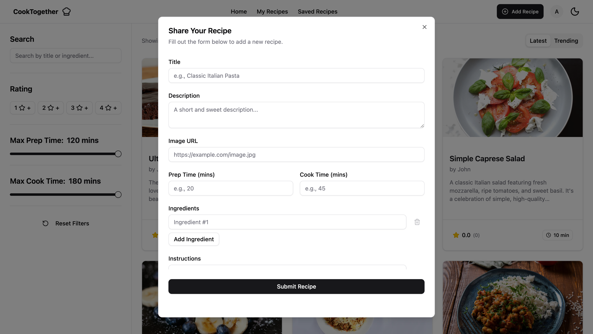 | 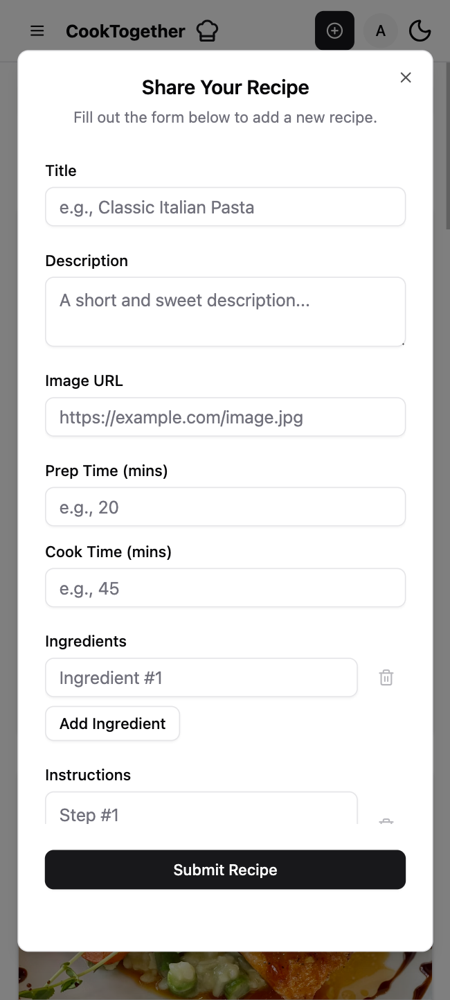 |

### Mobile Filtering and Navigation

| Filter Trigger                                         | Navigation Sheet                                       |
| ------------------------------------------------------ | -------------------------------------------------- |
| 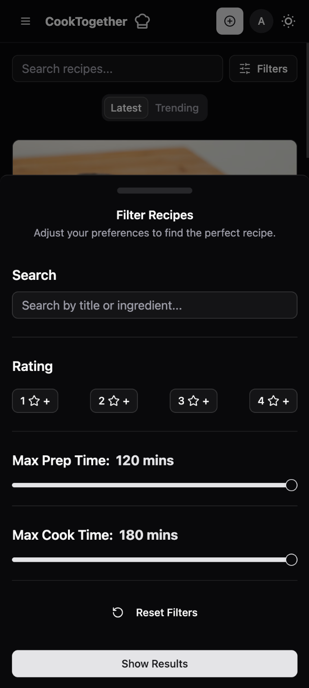 | 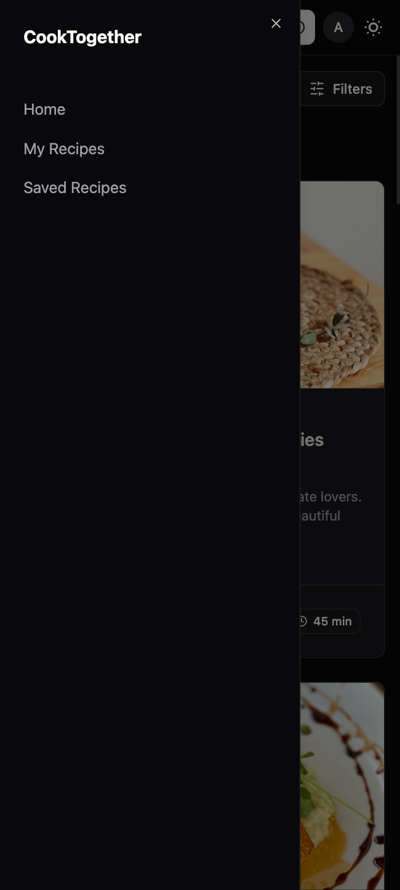 |

## Getting Started

Follow these instructions to get the project up and running on your local machine for development and testing purposes.

**For ease of testing, a pre-configured .env file is included already in both backend and frontend directories.**

### Prerequisites

You will need the following software installed on your machine:

-   Node.js (v18.x or later recommended)
-   npm (or yarn/pnpm)
-   MongoDB (either a local instance or a cloud-based service like MongoDB Atlas)

### Backend Setup

1.  **Navigate to the backend directory:**
    ```bash
    cd cooktogether-backend
    ```

2.  **Install dependencies:**
    ```bash
    npm install
    ```

3.  **Set up environment variables:**
    -   Create a copy of the example environment file: **copy `.env.example` to `.env`**.
    -   Fill in the required values in the `.env` file, such as your MongoDB connection string and Firebase service account details.

4.  **Start the server:**
    ```bash
    npm start
    ```
    The backend server will be running on the port specified in your `.env` file (e.g., `http://localhost:3000`).

### Frontend Setup

1.  **Navigate to the frontend directory:**
    ```bash
    cd cooktogether-frontend
    ```

2.  **Install dependencies:**
    ```bash
    npm install
    ```

3.  **Set up environment variables:**
    -   Create a copy of the example environment file: **copy `.env.example` to `.env`**.
    -   Fill in your Firebase client SDK configuration keys in the `.env` file.

4.  **Start the development server:**
    ```bash
    npm run dev
    ```
    The application will be available at `http://localhost:5173` (or another port if 5173 is in use).

### Licence
[](LICENSE)
